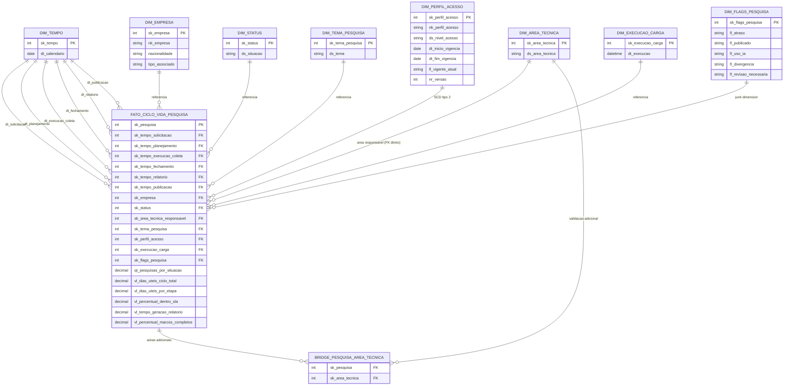

# Bridge Table, Junk Dimension e SCD — Cubo "Ciclo de Vida da Pesquisa"

**Interação com IA Generativa:** https://claude.ai/share/a0f39db7-ddb4-4107-ac6c-e90a0b8eb306

--- 

## 1. Contexto do cubo

Cubo escolhido: **Ciclo de Vida da Pesquisa** (cubo-1) do nosso Data Model Canvas. Foi o único cubo do canvas que já apontava, mesmo que resumidamente, tanto uma necessidade de bridge table quanto de junk dimension — por isso serviu de base pra desenvolver as três técnicas (bridge, junk, SCD) numa modelagem completa.

- **Tipo:** star schema, *accumulating snapshot*.
- **Grão:** uma linha por pesquisa (`sk_pesquisa`), acompanhada do início ao fim. As datas de marco — solicitação, planejamento, execução/coleta, fechamento, geração de relatório, publicação — são colunas da mesma linha, preenchidas conforme cada etapa acontece (dimensão de papéis `dim_tempo`).
- **Métricas:** `qt_pesquisas_por_situacao` (semiaditiva), `vl_dias_uteis_ciclo_total`, `vl_dias_uteis_por_etapa`, `vl_percentual_dentro_sla` (% dentro da faixa de 15–17 dias úteis), `vl_tempo_geracao_relatorio`, `vl_percentual_marcos_completos` — as últimas cinco não aditivas.
- **Dimensões:** `dim_tempo` (papéis de data), `dim_empresa` (conformada com o cubo-2, carrega todas as empresas associadas, não só as participantes), `dim_status`, `dim_area_tecnica`, `dim_tema_pesquisa`, `dim_perfil_acesso` (exclusiva deste cubo), `dim_execucao_carga`.
- **Ponto já sinalizado no canvas, mas não modelado:** relação N:N entre pesquisa e área técnica (quando mais de uma área valida a mesma pesquisa) e um conjunto de flags de baixa cardinalidade (atraso, publicação, uso de IA, divergência, revisão) sem estrutura própria — os dois pontos de partida deste documento.

Como o grão do fato já é a própria pesquisa, a dimensão conformada `dim_pesquisa` (usada nos cubos 2, 3 e 4) não é referenciada aqui — usá-la contradiria o próprio grão. A nota de SCD do canvas do cubo-1 ("dim_pesquisa: SCD tipo 2 para mudanças de tema, área responsável e classificação de acesso") não bate exatamente com os atributos hoje documentados em `dim_pesquisa` no cubo-2 (sk_pesquisa, nk_pesquisa, título, tipo e área técnica — sem tema, e classificação de acesso é declarada exclusiva do cubo-1). A explicação está registrada no próprio canvas do cubo-2: `dim_tema_pesquisa` foi "promovida a dimensão própria (antes ficava embutida em dim_pesquisa)". Ou seja, a nota do cubo-1 é resíduo de uma versão do canvas anterior a esse desmembramento, de quando tema ainda era atributo de `dim_pesquisa` — não uma inconsistência sem explicação. Lida assim, a nota descreve a política da dimensão conformada em sua versão histórica, não uma exigência de SCD sobre o cubo-1 em si; no cubo-1, tema, área e perfil de acesso são dimensões próprias, cada uma com sua decisão de SCD desenvolvida na Seção 4.

Outro cubo do canvas relevante pra este documento é o `cubo-4` (Pipeline Mensal da Operação): um *periodic snapshot* desenhado explicitamente — texto do próprio canvas do cubo-4 — pra quando "a origem guarda só o estado atual" e "o estado no passado exige um snapshot próprio". Ele volta a aparecer na Seção 4.3, porque é o mecanismo correto do projeto pra responder "como evoluiu o volume de pesquisas por área ao longo dos anos", não SCD Tipo 2 dentro do cubo-1.

---

## 2. Bridge table — `bridge_pesquisa_area_tecnica`

O canvas cita duas coisas que parecem a mesma relação mas não são: `dim_area_tecnica` como "área responsável pela validação" (singular, FK direto) e uma nota condicional — "caso uma pesquisa seja validada por mais de uma área técnica" — que descreve área(s) **adicional(is)**. São relações de naturezas diferentes: a primeira é 1:N normal (uma pesquisa tem uma área responsável); a segunda é N:N genuína (uma pesquisa pode ter várias áreas adicionais, e uma área pode validar várias pesquisas). Por isso o FK direto continua existindo no fato, e a bridge cobre só as validações extras — aplicar bridge table também na relação 1:N seria o erro clássico de usar a técnica onde ela não é necessária.

Pra evitar ambiguidade entre as duas colunas que apontam pra `dim_area_tecnica` (uma no fato, outra na bridge), o FK direto do fato foi renomeado para `sk_area_tecnica_responsavel`.

**Grão da bridge:** uma linha por combinação (pesquisa, área técnica adicional).

| Coluna | Papel | Descrição |
|---|---|---|
| `sk_pesquisa` | FK, parte da PK composta | Referencia `fato_ciclo_vida_pesquisa.sk_pesquisa` — aqui a bridge referencia a própria chave de grão do fato, não uma dimensão separada, já que a pesquisa é a linha do fato |
| `sk_area_tecnica` | FK, parte da PK composta | Referencia `dim_area_tecnica.sk_area_tecnica` — a área adicional que validou |

**PK composta:** `(sk_pesquisa, sk_area_tecnica)`, impedindo a mesma área aparecer duplicada pra mesma pesquisa.

**Peso de alocação:** ausente de propósito. Nenhuma métrica do cubo (`qt_pesquisas_por_situacao`, `vl_dias_uteis_ciclo_total`, `vl_dias_uteis_por_etapa`, `vl_percentual_dentro_sla`, `vl_tempo_geracao_relatorio`, `vl_percentual_marcos_completos`) é fracionável por área validadora — todas pertencem à pesquisa inteira. A bridge serve só pra listar/filtrar quais áreas validaram cada pesquisa, nunca pra somar métrica através dela.

**Trade-off aceito:** como a área principal é FK direto e as adicionais estão na bridge, um relatório de "todas as áreas envolvidas nesta pesquisa" precisa fazer `UNION` entre `fato.sk_area_tecnica_responsavel` e `bridge.sk_area_tecnica`. É o custo de manter as duas relações separadas (1:N e N:N) em vez de forçar tudo pela bridge — mas é o desenho que reflete corretamente a cardinalidade real de cada relação, em vez de tratar as duas como se fossem a mesma coisa.

**Limitação consciente desta entrega:** a bridge não tem `dt_inclusao` — não há registro de quando cada validação adicional foi incluída. Isso é assimétrico com a exigência de auditoria (`trilhaAuditoria`) usada na Seção 4 pra justificar SCD Tipo 2 em outras dimensões, e em rigor a mesma exigência poderia se estender a esta relação. Optamos por não expandir a bridge agora, pra não abrir a discussão de como popular esse campo retroativamente pras validações já existentes, o que foge do escopo desta entrega. Fica registrado aqui como limitação consciente, não como omissão despercebida — e como ponto de extensão futura.

---

## 3. Junk dimension — `dim_flags_pesquisa`

**Grão:** uma linha por combinação única de flags — não por pesquisa. Várias pesquisas com o mesmo conjunto de flags compartilham a mesma linha da junk.

| Coluna | Tipo | Observação |
|---|---|---|
| `sk_flags_pesquisa` | PK substituta | — |
| `fl_atraso` | S/N | |
| `fl_publicado` | S/N | Derivado de `dt_publicacao` no fato (preenchida = S). Mantido por conveniência de consulta — não é fonte de verdade paralela à data de publicação do fato. |
| `fl_uso_ia` | S/N | |
| `fl_divergencia` | S/N | |
| `fl_revisao_necessaria` | S/N | |

**Política de carga:** *lookup-or-insert* dinâmico, carregando só as combinações observadas nos dados reais — não o produto cartesiano completo dos 5 booleanos (que geraria 32 combinações teóricas). Pra cada linha carregada no fato, calcula-se a combinação de flags daquela pesquisa; se já existir em `dim_flags_pesquisa`, reaproveita-se o `sk_flags_pesquisa`; se não, insere-se uma linha nova. Carga observada é preferível aqui porque ainda não existem dados reais que sustentem a suposição de que as 32 combinações são igualmente prováveis ou mesmo possíveis no processo do projeto — pré-carregar tudo criaria linhas nunca referenciadas por nenhum fato.

Um exemplo ilustra o tipo de suposição que a carga observada evita fazer sem evidência — **hipótese, não fato confirmado nos dados**: é plausível que `fl_divergencia = S` implique `fl_revisao_necessaria = S` no fluxo real do projeto, o que eliminaria de saída boa parte das 32 combinações teóricas. Não temos os dados pra confirmar essa correlação; é só um indício de que a suposição de independência entre as 5 flags provavelmente não se sustenta, e mais um motivo pra carregar apenas o que ocorre de fato, em vez de assumir o produto cartesiano completo.

**Relação com o fato:** como o cubo é *accumulating snapshot* com a linha do fato sendo atualizada conforme o ciclo avança, `fato.sk_flags_pesquisa` é sobrescrito (reapontado) a cada atualização, igual às colunas de data de marco. A junk dimension não precisa de SCD própria — quem guarda o estado atual é o fato sendo atualizado, coerente com a nota do canvas de que o histórico materializado por este cubo é o do estado da pesquisa, não de atributos de dimensão.

---

## 4. Estratégia de SCD

O critério pede SCD escolhida e justificada para pelo menos 2 dimensões. Desenvolvemos três: `dim_empresa` (Tipo 1, por limitação da fonte de dados), `dim_perfil_acesso` (Tipo 2, por exigência de auditoria documentada) e `dim_area_tecnica` — que passou por Tipo 2 numa primeira revisão adversarial e voltou a Tipo 1 depois de um problema de mecanismo identificado numa segunda revisão, explicado em 4.3. As três juntas cobrem os desfechos que o critério quer ver: aceitar Tipo 1 por limitação de fonte, escolher Tipo 2 por exigência documentada, e reconhecer quando Tipo 2 parece justificado por uma pergunta de negócio mas não é o instrumento certo pra respondê-la.

### 4.1 `dim_empresa` — SCD Tipo 1

**Justificativa:** decisão reaproveitada do cubo-2 "Adesão e Participação", que compartilha esta dimensão conformada. A fonte (`empresas.csv`) é uma fotografia do momento, sem coluna de vigência — Tipo 2 exigiria uma fonte com data de início/fim de validade, que não existe hoje. A pergunta de negócio "Há diferença de adesão entre empresas nacionais e multinacionais?" é respondida corretamente com a classificação atual da empresa.

**Custo aceito:** perda de histórico — a análise por nacionalidade ou tipo de associado usa a classificação atual, não a da época da participação/pesquisa. Ponto de extensão condicionado à origem passar a fornecer vigência.

**Por que Tipo 1 nos dois cubos, não só no cubo-2:** `dim_empresa` é conformada entre cubo-1 e cubo-2. Manter a mesma estratégia de SCD nos dois cubos que a compartilham não é opcional — é o próprio conceito de dimensão conformada. Se um cubo usasse Tipo 2 e o outro Tipo 1 pra mesma dimensão, haveria duas versões de histórico divergentes pra mesma empresa dependendo de qual cubo o analista consultasse.

### 4.2 `dim_perfil_acesso` — SCD Tipo 2

**Justificativa:** o campo `trilhaAuditoria` do próprio cubo-1 exige "registrar... alteração de status... com ator, timestamp, versão e resultado". Uma pesquisa nasce com acesso restrito e se torna pública na publicação — pra atender a essa exigência é preciso saber quando cada nível de acesso vigorou, não só qual é o atual. Não é SCD 2 por precaução: é uma exigência de auditoria já documentada no projeto, que só Tipo 2 resolve.

**Por que o mecanismo de Tipo 2 funciona aqui, diferente de `dim_area_tecnica` (ver 4.3):** `nk_perfil_acesso` representa a própria pesquisa, não uma categoria de baixa cardinalidade compartilhada por muitas pesquisas ao mesmo tempo. Cada pesquisa tem sua própria cadeia de versões — quando o nível de acesso de uma pesquisa muda, insere-se uma linha nova com o mesmo `nk_perfil_acesso` (a pesquisa) e vigência ajustada, sem afetar a vigência de nenhuma outra pesquisa. Na prática funciona como uma versão da própria pesquisa, não uma dimensão de categoria reutilizada entre muitos fatos (o termo é usado aqui no sentido funcional — chave natural granular por pesquisa —, diferente do padrão formal Kimball de "mini-dimensão", que resolve outro problema, o de atributos de mudança rápida numa dimensão grande). É exatamente o cenário em que SCD Tipo 2 versiona corretamente a entidade que muda, evitando o problema de linha compartilhada que inviabilizou Tipo 2 em `dim_area_tecnica`.

| Coluna | Observação |
|---|---|
| `sk_perfil_acesso` | PK substituta — nova linha a cada mudança |
| `nk_perfil_acesso` | Chave natural, estável entre versões |
| `ds_nivel_acesso` | Assumido (ex.: Restrito/Interno/Público) — o canvas só menciona o nome da dimensão, sem listar atributos; ajustar conforme definição real do time |
| `dt_inicio_vigencia` | |
| `dt_fim_vigencia` | Nulo/aberto = versão vigente |
| `fl_vigente_atual` | S/N |
| `nr_versao` | Alinhado ao campo "versão" já exigido pela `trilhaAuditoria` do canvas |

**Custo aceito:** crescimento da dimensão a cada mudança de nível de acesso, e complexidade adicional na consulta. Como o fato é *accumulating snapshot* com uma única linha por pesquisa, `fato.sk_perfil_acesso` aponta sempre pra versão atualmente vigente — pra saber qual era o nível de acesso num marco específico (ex.: na solicitação), é preciso cruzar a data daquele marco com `dim_perfil_acesso` usando `BETWEEN dt_inicio_vigencia AND dt_fim_vigencia`, não basta seguir o FK do fato.

### 4.3 `dim_area_tecnica` — SCD Tipo 1 (revertido de Tipo 2)

**Evolução da decisão:** numa primeira revisão adversarial desta modelagem, promovemos esta dimensão a SCD Tipo 2, com a pergunta de negócio "Como evoluiu o volume de pesquisas por área ao longo dos anos?" como gatilho. Numa segunda revisão, identificamos um problema de mecanismo que a primeira não tinha considerado: SCD Tipo 2 versiona mudanças num atributo da **própria entidade** da dimensão (ex.: a empresa mudando de porte). Em `dim_area_tecnica`, o que muda ao longo do tempo não é um atributo da área em si — "Legislação" continua sendo "Legislação" — é o FK do fato apontando pra uma linha diferente dessa dimensão, que é pequena e compartilhada por muitas pesquisas ao mesmo tempo. Dar uma janela de vigência à linha "Legislação" não representa quando **cada pesquisa individualmente** foi reclassificada pra essa área: a mesma linha é referenciada por dezenas de pesquisas simultaneamente, cada uma com seu próprio histórico de reclassificação, potencialmente diferente das demais. Versionar a linha compartilhada não resolve o problema que a pergunta de negócio propõe — resolveria só se a área em si tivesse atributos próprios mudando, o que não é o caso aqui.

**Onde a pergunta de negócio é respondida de verdade:** o canvas do projeto já resolve isso de outro jeito. `cubo-4` (Pipeline Mensal da Operação) é um *periodic snapshot*, desenhado explicitamente — texto do próprio canvas do cubo-4 — pra quando "a origem guarda só o estado atual" e "o estado no passado exige um snapshot próprio". É o `cubo-4`, não SCD Tipo 2 dentro do cubo-1, que responde "como evoluiu o volume de pesquisas por área ao longo dos anos": cada corte periódico do snapshot já captura a área vigente de cada pesquisa naquele momento, sem exigir que `dim_area_tecnica` guarde histórico algum.

**Decisão final:** SCD Tipo 1. `dim_area_tecnica` permanece uma dimensão de categoria simples — `sk_area_tecnica`, `nk_area_tecnica`, `ds_area_tecnica` —, sobrescrita in-place quando a descrição de uma área muda (algo distinto de, e bem mais raro que, a reclassificação de pesquisas entre áreas).

**Custo aceito:** nenhum relevante — a pergunta de negócio que motivaria histórico é respondida por outro cubo do modelo, não por esta dimensão. O ganho de manter Tipo 1 é evitar um histórico que não representaria corretamente o que a pergunta pede.

---

## 5. Diagrama

---

## 6. Premissas assumidas, a validar

- `cubo-4` (Pipeline Mensal da Operação) tem periodicidade suficiente pra capturar reclassificações de área com a granularidade que a pergunta de negócio da Seção 4.3 exige — não verificamos isso em detalhe; é uma dependência da resposta dada ali, não deste documento.
- `dim_tema_pesquisa` tem gatilho analítico semelhante ao de área técnica ("quais temas se repetem ao longo dos anos e com que frequência") e é estruturalmente igual a `dim_area_tecnica` — dimensão pequena, compartilhada por muitas pesquisas ao mesmo tempo. O mesmo problema de mecanismo da Seção 4.3 se aplicaria a ela: SCD Tipo 2 também versionaria uma linha compartilhada, não a reclassificação de cada pesquisa. Não desenvolvemos essa dimensão neste documento, mas a conclusão seria Tipo 1 pelo mesmo motivo — com a pergunta de negócio dependendo de um cubo periodic snapshot equivalente ao cubo-4, a confirmar se existe cobertura pra tema.
- Área responsável (FK direto no fato) e áreas adicionais (bridge) são duas relações distintas do processo real, não uma única relação mal documentada no canvas.
- As flags de `dim_flags_pesquisa` são reavaliadas a cada atualização do *accumulating snapshot*, não fixadas uma única vez no fechamento da pesquisa.
- Atributos reais de `dim_perfil_acesso` além do nome da dimensão — `ds_nivel_acesso` é uma suposição, a confirmar com a definição completa do time.
- FKs de dimensões associadas a marcos que ainda não ocorreram (ex.: `sk_area_tecnica_responsavel` e `sk_perfil_acesso` antes de a pesquisa ter área ou classificação de acesso atribuída) seguem a convenção de membro desconhecido já declarada no canvas do projeto (chave -1, "Não informado"), não `NULL` — a aplicação consistente disso em todas as dimensões do cubo-1 fica a confirmar na ETL.

---

## 7. Conclusão

A modelagem partiu da regra que a atividade cobra: nenhuma técnica foi aplicada por padrão. A bridge table só existe onde a cardinalidade é genuinamente N:N (áreas adicionais), mantendo separada a relação 1:N real (área responsável) — evitando o erro de forçar bridge onde ela não é necessária. A junk dimension agrupa cinco flags de baixa cardinalidade sob uma chave substituta, mas carrega só as combinações observadas nos dados, não um produto cartesiano assumido sem evidência. E o SCD foi decidido dimensão a dimensão a partir de gatilhos reais: Tipo 1 para `dim_empresa` porque a fonte não sustenta mais que isso, Tipo 2 para `dim_perfil_acesso` porque existe uma exigência de auditoria documentada que só histórico resolve e porque sua chave natural é granular o suficiente (por pesquisa) pra o mecanismo de Tipo 2 fazer sentido, e Tipo 1 para `dim_area_tecnica` — não por faltar pergunta de negócio, mas porque SCD Tipo 2 numa dimensão pequena e compartilhada por muitas pesquisas não é o instrumento certo pra respondê-la; quem responde é o `cubo-4`, já desenhado pra isso no canvas do projeto.

Essa versão passou por duas rodadas de revisão adversarial nesta mesma conversa, em que tentamos ativamente derrubar as decisões já tomadas em vez de só confirmá-las. A primeira rodada reforçou a leitura da nota de SCD do cubo-1 com evidência concreta do canvas do cubo-2 (o desmembramento de `dim_tema_pesquisa`), promoveu `dim_area_tecnica` a SCD Tipo 2 ao corrigir uma confusão entre frequência de mudança e necessidade de histórico, marcou o exemplo da junk dimension como hipótese ilustrativa em vez de fato assumido, e tornou explícita a limitação da bridge table sem `dt_inclusao`. A segunda rodada reverteu parte da primeira: identificou que SCD Tipo 2 pressupõe versionar um atributo da própria entidade da dimensão, não o FK do fato sendo reapontado numa dimensão pequena e compartilhada por muitas pesquisas ao mesmo tempo — e que `dim_area_tecnica` se encaixava no segundo caso, não no primeiro. `dim_perfil_acesso` escapa desse problema porque sua chave natural é a própria pesquisa, não uma categoria reutilizada entre muitos fatos. Manter essa evolução no documento, incluindo o passo que foi revertido, é evidência de que a decisão final não foi tomada por precaução nem por conveniência — foi testada e, num dos três casos, corrigida. É esse raciocínio, mais do que o diagrama em si, que a Ponderada pede pra demonstrar.
